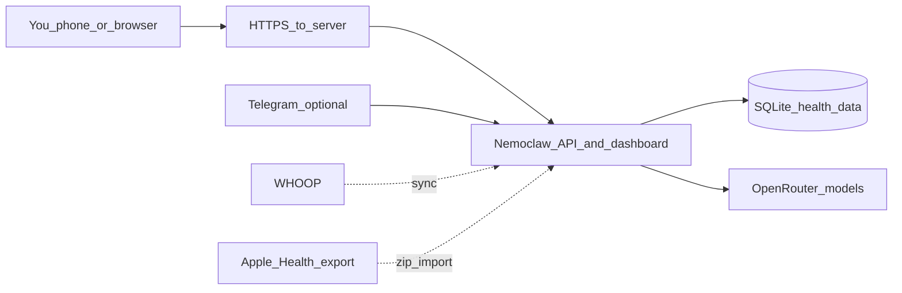

# Nemoclaw Health on AWS

This repository contains the AWS-ready Nemoclaw Health stack: a private health-coaching web app, a small API server, wearable-data connectors, safety rules for the coaching agents, and deployment scripts for running it on one Ubuntu EC2 server.

The canonical public repository is [`https://github.com/cj1101/healthClawAWS.git`](https://github.com/cj1101/healthClawAWS.git).

## Table of Contents

- [Who This Is For](#who-this-is-for)
- [What The Program Does](#what-the-program-does)
- [How The Pieces Fit Together](#how-the-pieces-fit-together)
- [If You Have Never Used A Terminal](#if-you-have-never-used-a-terminal)
- [Use It Locally](#use-it-locally)
- [Run It On AWS](#run-it-on-aws)
- [Connect WHOOP](#connect-whoop)
- [Import Apple Health](#import-apple-health)
- [Telegram Bot](#telegram-bot)
- [Data, Privacy, And Backups](#data-privacy-and-backups)
- [Safety Boundaries](#safety-boundaries)
- [Repository Map](#repository-map)
- [Developer Checks](#developer-checks)
- [Glossary](#glossary)

## Who This Is For

You can read this project from three different angles:

- **End user:** You want to use the dashboard or Telegram bot to talk with the health coach. You should not need to know Python, Node.js, Git, or AWS.
- **Trusted operator:** You are the person who runs the private server. You will set passwords, API keys, WHOOP credentials, and AWS networking.
- **Contributor:** You want to improve the app, agent contracts, connectors, tests, or deployment scripts.

The project is not meant to replace medical care. It can organize health data, coach, summarize, and prompt reflection, but urgent symptoms and medical decisions belong with qualified clinicians or emergency services.

## What The Program Does

Nemoclaw Health gives you a private health-coaching service with:

- A browser dashboard served by FastAPI.
- A chat endpoint where Popeye is the user-visible coaching voice.
- WHOOP OAuth connection and sync.
- Apple Health export ZIP import.
- SQLite storage for local health data, goals, events, and agent traces.
- Retention jobs so raw events and orchestration metadata do not grow forever.
- Safety artifacts for Joy, the safety-focused health agent.
- EC2 deployment scripts for Nginx, systemd, timers, and local SQLite.

## How The Pieces Fit Together



In plain English: you open the website or Telegram, the server receives your request, the app reads or writes your local SQLite data, and the coach may call an LLM through OpenRouter when it needs to answer.

## If You Have Never Used A Terminal

A terminal is a text window where you type commands. It looks intimidating at first, but this project tries to keep commands copy-paste friendly.

Some practical rules:

- Copy one command block at a time.
- Press Enter after pasting.
- If a command asks a yes/no question, read it before pressing `y`.
- Passwords and API keys go in `.env`; they should never be pasted into GitHub.
- If a command says `YOUR_DOMAIN`, `YOUR_KEY`, or `YOUR_EC2_PUBLIC_HOSTNAME`, replace that placeholder with your real value.
- If something fails, copy the exact error text. Most setup problems are missing credentials, wrong folder, Python version, or an unmatched WHOOP redirect URL.

The trusted operator is the only person who needs terminal access. Friends or clients using the coach should only need the dashboard URL, password, or Telegram bot.

## Use It Locally

Local setup is for contributors and operators testing before AWS.

### Prerequisites

- Python 3.11 or newer.
- Node.js 18 or newer.
- Git.

### Clone The Repo

```bash
git clone https://github.com/cj1101/healthClawAWS.git
cd healthClawAWS
```

### Install Dependencies

```bash
pip install -r requirements.txt
npm install
```

### Run Validation

```bash
npm run validate:phase2
```

This runs the Phase 0 contract checks and the Python test suite.

### Start The App

```bash
cd runtime
PYTHONPATH=. uvicorn nemoclaw_health.app:app --reload --host 0.0.0.0 --port 8000
```

Then open [`http://localhost:8000/`](http://localhost:8000/) in your browser.

## Run It On AWS

The intended low-cost deployment is one Ubuntu EC2 instance:

- Nginx receives web traffic on ports 80 and 443.
- Uvicorn runs the FastAPI app on local port 8000.
- SQLite stores the app data on the instance.
- systemd timers trigger WHOOP sync and retention jobs.

Start with the full EC2 guide: [`docs/ec2-debug.md`](docs/ec2-debug.md).

The short version, from the repo root on the EC2 instance:

```bash
chmod +x deploy/ec2/bootstrap.sh
./deploy/ec2/bootstrap.sh
cp deploy/ec2/ec2.env.example .env
chmod 600 .env
```

Then edit `.env` with real values and restart the service:

```bash
sudo systemctl restart nemoclaw-health
```

Important production settings:

- `NEMOWLAW_DASHBOARD_PASSWORD` protects the dashboard and most `/v1/*` routes.
- `NEMOWLAW_SESSION_SECRET` signs browser sessions. Set it to a long random value.
- `NEMOWLAW_JOB_TOKEN` lets systemd timers call `/v1/jobs/*` safely.
- `NEMOWLAW_CHAT_BEARER_TOKEN` lets trusted automation, such as Telegram, call `/v1/chat` when dashboard auth is enabled.
- `NEMOWLAW_OPENROUTER_API_KEY` lets the coach call OpenRouter.
- WHOOP settings are covered below.

## Connect WHOOP

WHOOP uses OAuth, which means the app sends you to WHOOP, you approve access, and WHOOP sends the app back a code.

1. Create or edit your OAuth app in the [WHOOP Developer Dashboard](https://developer-dashboard.whoop.com/apps).
2. Set the redirect URL to exactly match your app, for example:

```text
https://your-domain.example/v1/connectors/whoop/callback
```

3. Put matching values in `.env`:

```bash
WHOOP_CLIENT_ID=your-client-id
WHOOP_CLIENT_SECRET=your-client-secret
NEMOWLAW_WHOOP_REDIRECT_URI=https://your-domain.example/v1/connectors/whoop/callback
```

WHOOP does not accept public `http://` redirect URLs. Use HTTPS for a public hostname. The EC2 guide explains the Nginx and Certbot path.

The app flow is:

```text
GET /v1/connectors/whoop/authorize-url
browser approval at WHOOP
GET /v1/connectors/whoop/callback
POST /v1/connectors/whoop/sync
```

If the dashboard says WHOOP authorization cannot start, check that the client ID, client secret, and redirect URI are present and match the WHOOP dashboard exactly.

## Import Apple Health

On iPhone:

1. Open Health.
2. Tap your profile picture.
3. Choose Export All Health Data.
4. Use the ZIP that contains `apple_health_export/export.xml`.
5. Upload that ZIP through the dashboard, or send it to `POST /v1/connectors/apple-health/import` as multipart field `file`.

Re-importing the same data is designed to deduplicate stable records.

## Telegram Bot

The optional Telegram bridge lives at [`runtime/nemoclaw_health/telegram_bot.py`](runtime/nemoclaw_health/telegram_bot.py).

Environment variables:

- `TELEGRAM_BOT_TOKEN`: token from BotFather.
- `TELEGRAM_ALLOWED_USER_IDS`: comma-separated numeric Telegram user IDs. Usernames like `@name` are not accepted.
- `TELEGRAM_NEMOWLAW_API_BASE`: usually `http://127.0.0.1:8000` when the bot runs on the same EC2 instance.
- `NEMOWLAW_CHAT_BEARER_TOKEN`: must match the API's value when `NEMOWLAW_DASHBOARD_PASSWORD` is enabled.
- `TELEGRAM_CHAT_HTTP_TIMEOUT_S`: optional timeout for long chat turns; default is 900 seconds.

The bot registers `/start`, `/help`, `/new`, and `/summary` on startup. Plain text messages are forwarded to `POST /v1/chat`.

## Data, Privacy, And Backups

Secrets belong in `.env`, not in Git. The repository ignores `.env`, `.pem`, local SQLite data, virtual environments, logs, and runtime artifacts.

Default storage behavior:

| Entity | Policy |
| --- | --- |
| `raw_events` | Default 90-day prune with `NEMOWLAW_RAW_EVENT_RETENTION_DAYS`. |
| `connector_idempotency` | Rows tied to pruned raw events are removed so old windows can be re-ingested if needed. |
| `delegation_events`, `agent_runs` | Optional prune with `NEMOWLAW_DELEGATION_METADATA_RETENTION_DAYS`; disabled when empty or `0`. |
| SQLite | Uses WAL journal mode and configurable busy timeout. |
| JSONL export | `POST /v1/storage/export-raw-jsonl` writes a raw-events backup under the configured data directory. |

For a full backup, copy both the SQLite database and any exported JSONL artifacts. The default SQLite path is under the runtime data directory unless `NEMOWLAW_SQLITE_PATH` is set.

## Safety Boundaries

The project keeps health coaching and medical safety separate:

- Popeye is the only user-visible synthesizer.
- Stan, Dick, Joy, data-entry, and debug agents should return structured information rather than speaking directly to the user.
- Joy safety templates and escalation rules live in [`specs/phase0/safety/`](specs/phase0/safety/).
- Agent contracts, tool permissions, and event schemas live in [`specs/phase0/contracts/`](specs/phase0/contracts/).
- `npm run validate:phase0` checks these contract files and safety regression cases.

## Repository Map

| Path | Purpose | Best audience |
| --- | --- | --- |
| [`runtime/nemoclaw_health/`](runtime/nemoclaw_health/) | FastAPI app, dashboard, orchestration, storage, auth, and connectors. | Contributors and operators |
| [`runtime/nemoclaw_health/static/dashboard/`](runtime/nemoclaw_health/static/dashboard/) | Browser dashboard files. | Contributors |
| [`deploy/ec2/`](deploy/ec2/) | EC2 bootstrap, Nginx config, systemd units, timer scripts, and smoke tests. | Operators |
| [`docs/ec2-debug.md`](docs/ec2-debug.md) | Production-lite EC2 setup and troubleshooting. | Operators |
| [`docs/VENDOR_ENTRYPOINTS.md`](docs/VENDOR_ENTRYPOINTS.md) | Notes about the vendored OpenClaw health stack. | Contributors |
| [`specs/phase0/contracts/`](specs/phase0/contracts/) | Agent contracts, permissions, JSON schemas, and sample envelopes. | Contributors and reviewers |
| [`specs/phase0/safety/`](specs/phase0/safety/) | Joy safety policy, templates, escalation rules, and regression cases. | Contributors and reviewers |
| [`scripts/`](scripts/) | Validation helpers. | Contributors |
| [`tests/`](tests/) | Python test suite for runtime behavior. | Contributors |
| [`vendor/openclaw-health/`](vendor/openclaw-health/) | Vendored OpenClaw health-coach assets and reference configs. | Contributors |

For a deeper module-by-module explanation, see [`docs/ARCHITECTURE.md`](docs/ARCHITECTURE.md).

## Developer Checks

Run the complete local validation:

```bash
npm run validate:phase2
```

Run only the JSON contract and safety checks:

```bash
npm run validate:phase0
```

Run the vendored health-coach smoke test:

```bash
cd vendor/openclaw-health/skills/health-coach
python -m pytest tests/test_health_team_contracts.py -q
```

## Glossary

- **API:** A structured way for software to ask another program to do something.
- **AWS:** Amazon Web Services, the cloud provider used here.
- **Bearer token:** A secret string sent with a request to prove it is trusted.
- **EC2:** An AWS virtual server.
- **FastAPI:** The Python web framework serving the app.
- **Git:** The tool developers use to track file changes.
- **GitHub:** The website where this repository is hosted.
- **Nginx:** The front web server that receives public traffic before passing it to FastAPI.
- **OAuth:** A sign-in approval flow used by services like WHOOP.
- **OpenRouter:** The LLM API provider used by the coach.
- **SQLite:** A single-file database stored on the server.
- **SSH:** A secure way to log into a server from your computer.
- **systemd:** The Linux service manager that keeps the app and scheduled jobs running.
- **Terminal:** A text window where you type commands.
- **Uvicorn:** The Python server process that runs the FastAPI app.
