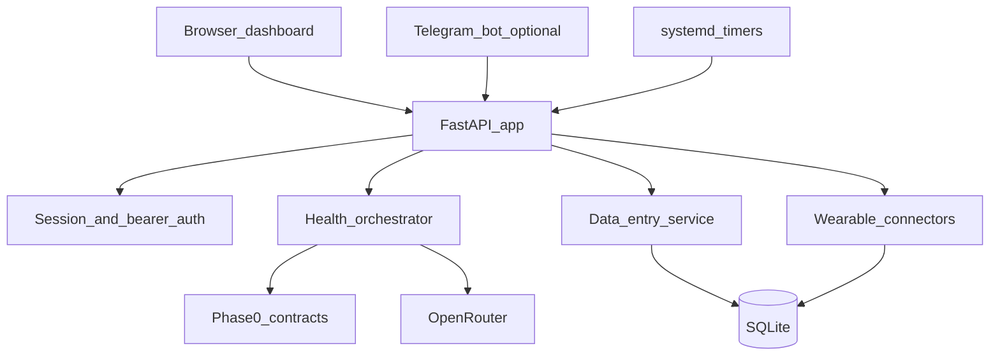
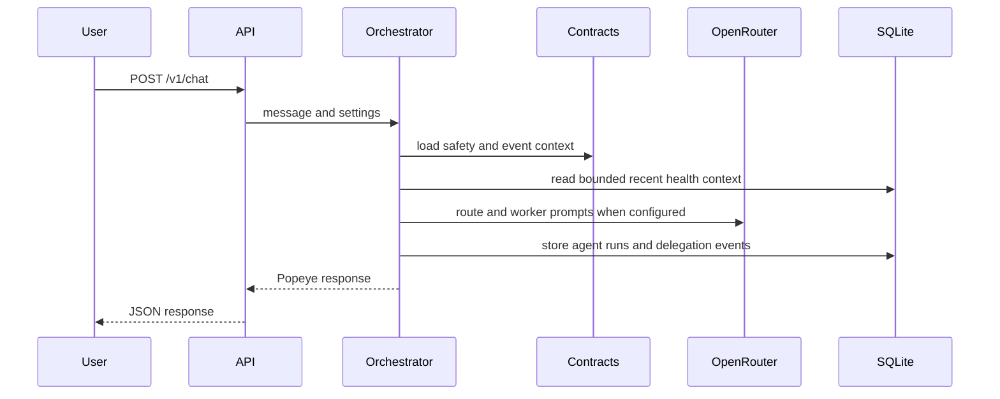
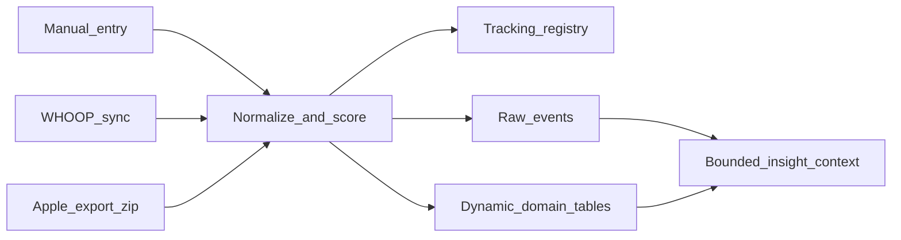

# Architecture

This document is the technical companion to the README. It explains how the main code paths fit together without requiring readers to open every file first.

## Runtime Shape

At runtime, [`runtime/nemoclaw_health/app.py`](../runtime/nemoclaw_health/app.py) builds the FastAPI application, registers HTTP routes, installs dashboard auth, mounts the static dashboard, and wires request handlers to the services below it.

## Main Modules

| Module | Responsibility |
| --- | --- |
| [`app.py`](../runtime/nemoclaw_health/app.py) | HTTP entrypoint, route registration, dashboard mounting, auth setup, job endpoints, connector endpoints. |
| [`settings.py`](../runtime/nemoclaw_health/settings.py) | Environment variable loading from repo-root `.env` and runtime `.env`; resolves database, artifact, and connector settings. |
| [`auth_http.py`](../runtime/nemoclaw_health/auth_http.py) | Dashboard session authentication plus bearer-token exceptions for job and chat automation. |
| [`orchestrator.py`](../runtime/nemoclaw_health/orchestrator.py) | Classifies chat intent, calls worker-style health agents, validates orchestration events, and produces the user-visible response. |
| [`openrouter_client.py`](../runtime/nemoclaw_health/openrouter_client.py) | Calls OpenRouter and parses LLM JSON objects. |
| [`data_entry.py`](../runtime/nemoclaw_health/data_entry.py) | Normalizes manual and connector data, creates tracking domains, stores raw events, and builds bounded insight context. |
| [`db.py`](../runtime/nemoclaw_health/db.py) | SQLite schema, migrations, transaction wrapper, and persistence helpers. |
| [`retention.py`](../runtime/nemoclaw_health/retention.py) | Prunes raw events and optional delegation metadata. |
| [`export_backup.py`](../runtime/nemoclaw_health/export_backup.py) | Exports raw events to JSONL for backup or inspection. |
| [`storage_catalog.py`](../runtime/nemoclaw_health/storage_catalog.py) | Summarizes storage domains and tables for dashboard/debug surfaces. |
| [`debug_service.py`](../runtime/nemoclaw_health/debug_service.py) | Reads recent agent sessions and task traces for troubleshooting. |
| [`events.py`](../runtime/nemoclaw_health/events.py) | Validates orchestration event envelopes and user-visibility invariants. |
| [`contracts_runtime.py`](../runtime/nemoclaw_health/contracts_runtime.py) | Loads contract context into prompts and runtime validation. |
| [`artifacts.py`](../runtime/nemoclaw_health/artifacts.py) | Appends JSONL artifacts for orchestration traces. |
| [`telegram_bot.py`](../runtime/nemoclaw_health/telegram_bot.py) | Optional Telegram bridge to `POST /v1/chat`. |

## HTTP Surface

The public API is intentionally small and grouped by job:

| Area | Routes |
| --- | --- |
| Health and auth | `GET /healthz`, `POST /v1/auth/login`, `POST /v1/auth/logout` |
| User data | `GET /v1/profile`, `PUT /v1/profile`, `GET /v1/goals`, `POST /v1/goals`, `GET /v1/timeline` |
| Chat | `POST /v1/chat` |
| Data entry | `POST /v1/data/domain`, `POST /v1/data/ingest`, `POST /v1/data/clarifications/{id}/commit`, `POST /v1/data/clarifications/{id}/cancel` |
| Storage | `GET /v1/storage/summary`, `GET /v1/storage/catalog`, `POST /v1/storage/export-raw-jsonl` |
| Jobs | `POST /v1/jobs/raw-event-prune`, `POST /v1/jobs/delegation-prune`, `POST /v1/jobs/whoop-sync` |
| Contracts | `POST /v1/contracts/validate-event` |
| Debug | `GET /v1/debug/sessions`, `GET /v1/debug/session/{task_id}`, `POST /v1/debug/analyze` |
| WHOOP | `GET /v1/connectors/whoop/status`, `GET /v1/connectors/whoop/authorize-url`, `GET /v1/connectors/whoop/callback`, `POST /v1/connectors/whoop/disconnect`, `POST /v1/connectors/whoop/sync` |
| Apple Health | `GET /v1/connectors/apple-health/status`, `POST /v1/connectors/apple-health/import` |

The browser dashboard is served from `GET /` and static files under [`runtime/nemoclaw_health/static/dashboard/`](../runtime/nemoclaw_health/static/dashboard/).

## Chat And Agent Flow

Popeye is the user-visible voice. Other roles, such as Stan, Dick, Joy, data-entry, and debug, are meant to contribute structured information that Popeye can synthesize. The runtime enforces that boundary through event validation in [`events.py`](../runtime/nemoclaw_health/events.py) and the Phase 0 contract files.

## Data Flow

Manual entries, WHOOP syncs, and Apple Health imports all become normalized records before storage:

The SQLite database is initialized and migrated by [`db.py`](../runtime/nemoclaw_health/db.py). Its important tables include `user_profile`, `goals`, `tracking_registry`, `raw_events`, `derived_summaries`, `agent_runs`, `delegation_events`, `connector_states`, `manual_edits`, and `disclaimer_audit`.

## Connectors

WHOOP code lives under [`runtime/nemoclaw_health/connectors/`](../runtime/nemoclaw_health/connectors/):

- [`whoop_oauth.py`](../runtime/nemoclaw_health/connectors/whoop_oauth.py) validates WHOOP config, builds authorization URLs, exchanges callback codes, refreshes tokens, and stores connector state.
- [`whoop_client.py`](../runtime/nemoclaw_health/connectors/whoop_client.py) wraps WHOOP API calls.
- [`whoop_sync.py`](../runtime/nemoclaw_health/connectors/whoop_sync.py) syncs records into app storage.

Apple Health import lives in [`apple_health.py`](../runtime/nemoclaw_health/connectors/apple_health.py). It expects a ZIP containing `apple_health_export/export.xml`, parses supported records, and deduplicates imports.

## Contracts And Safety

The repository keeps governance files separate from runtime code:

| Path | Meaning |
| --- | --- |
| [`specs/phase0/contracts/agent_contracts.md`](../specs/phase0/contracts/agent_contracts.md) | Human-readable role and boundary description. |
| [`specs/phase0/contracts/event_schema.json`](../specs/phase0/contracts/event_schema.json) | JSON Schema for orchestration envelopes. |
| [`specs/phase0/contracts/permission_matrix.json`](../specs/phase0/contracts/permission_matrix.json) | Which agent may perform which action. |
| [`specs/phase0/contracts/tool_registry.json`](../specs/phase0/contracts/tool_registry.json) | Known tool IDs and visibility rules. |
| [`specs/phase0/safety/safety_policy.md`](../specs/phase0/safety/safety_policy.md) | Joy safety policy. |
| [`specs/phase0/safety/joy_templates.json`](../specs/phase0/safety/joy_templates.json) | Required Joy disclaimer templates. |
| [`specs/phase0/safety/joy_escalation_rules.json`](../specs/phase0/safety/joy_escalation_rules.json) | Escalation triggers and tiers. |
| [`specs/phase0/safety/safety_regression_cases.json`](../specs/phase0/safety/safety_regression_cases.json) | Positive and failure cases for validation. |

[`scripts/validate-phase0.mjs`](../scripts/validate-phase0.mjs) validates those files. `npm run validate:phase2` runs that validator and then the Python test suite.

## Deployment

The EC2 deployment files are under [`deploy/ec2/`](../deploy/ec2/):

| Path | Purpose |
| --- | --- |
| [`bootstrap.sh`](../deploy/ec2/bootstrap.sh) | One-command production-lite setup for an Ubuntu EC2 checkout. |
| [`setup-services.sh`](../deploy/ec2/setup-services.sh) | Installs or updates systemd and Nginx service files. |
| [`ec2.env.example`](../deploy/ec2/ec2.env.example) | Example `.env` for dashboard auth, job tokens, OpenRouter, WHOOP, Telegram, and retention settings. |
| [`systemd/`](../deploy/ec2/systemd/) | App service and scheduled timer units. |
| [`nginx/`](../deploy/ec2/nginx/) | Nginx site templates. |
| [`scripts/`](../deploy/ec2/scripts/) | Job helper scripts used by timers and operators. |

The app is designed for a simple single-node deployment. It is not a high-availability cluster. Backups, instance snapshots, DNS, TLS renewal, and secret rotation remain operator responsibilities.

## Testing Strategy

- Contract and safety files are validated by `npm run validate:phase0`.
- Runtime behavior is covered by the Python tests in [`tests/`](../tests/).
- CI should run `npm run validate:phase2`, which combines both layers.
- Deployment scripts include smoke-test helpers under [`deploy/ec2/`](../deploy/ec2/).

Use focused tests for code changes, then run the full phase2 validation before opening or merging a pull request.
